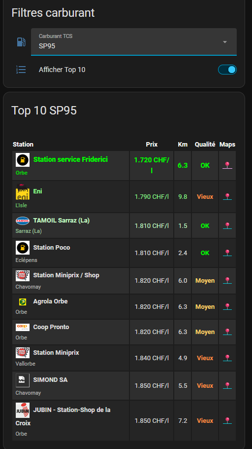
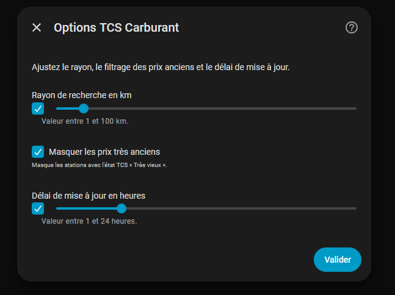

# ⛽ TCS Carburant pour Home Assistant

Une intégration Home Assistant permettant de récupérer automatiquement les prix des carburants directement depuis le site officiel du Touring Club Suisse (TCS).

Compatible avec Home Assistant 2026+ et installable directement via HACS.

## ✨ Fonctionnalités
- 🇨🇭 Swiss stations
  - SP95
  - SP98
  - Diesel
- 📍 Recherche des stations autour de votre domicile
- 💰 Classement automatique des stations les moins chères
- 🏷️ Affichage du logo de l'enseigne
- 🏙️ Affichage de la ville
- 📏 Distance jusqu'à la station
- 🗺️ Lien Google Maps
- 🚫 Possibilité de masquer les prix Très vieux
- ⚙️ Rayon de recherche configurable
- 🔄 Fréquence de mise à jour configurable
- ❤️ Installation via HACS

---

## 📸 Aperçu
### Tableau de bord



### Configuration


---

## 📦 Installation
Via HACS

Ajouter ce dépôt comme dépôt personnalisé :

https://github.com/froguinou/hass-tcs-carburant

Type :

Intégration

Installer TCS Carburant puis redémarrer Home Assistant.

---

## ➕ Configuration

Après le redémarrage :

Paramètres
→ Appareils et services
→ Ajouter une intégration
→ TCS Carburant

Aucune configuration YAML n'est nécessaire.

---

## ⚙️ Options disponibles
| Paramètre | Description |
| --- | --- |
| Rayon de recherche | Distance maximale autour du domicile |
| Masquer les prix très vieux | Ignore les stations dont le prix est considéré comme obsolète par le TCS |
|Délai de mise à jour | Actualisation automatique des données |

---

## 📊 Entités créées

Pour chaque carburant :

sensor.tcs_sp95_moins_cher

sensor.tcs_sp95_top_1
...
sensor.tcs_sp95_top_10

sensor.tcs_sp98_...

sensor.tcs_diesel_...

Chaque capteur contient également de nombreux attributs :

- Nom de la station
- Marque
- Ville
- Adresse
- Distance
- Logo
- Niveau de fiabilité TCS
- Date de mise à jour
- Lien Google Maps
  
---

## 🖥️ Carte Lovelace

Le dépôt fournit également un exemple complet de tableau de bord comprenant :

- Sélecteur SP95 / SP98 / Diesel
- Sélecteur Top 3 / Top 10
- Logos des enseignes
- Distance
- Ville
- Lien Google Maps
- Couleurs selon la fiabilité du prix

---

## 🔄 Nouveautés de la version 0.3.0
- Nouvelle architecture Home Assistant
- Configuration entièrement via l'interface
- Suppression de la configuration YAML
- DataUpdateCoordinator
- Rayon configurable
- Mise à jour configurable
- Filtre des prix très anciens
- Gestion automatique des logos
- Traductions
- Amélioration des performances
- Amélioration de la stabilité
  
---

## Lovelace Example

### Example flitre dashboard:
Crée les boutons
```yaml
input_select:
  carburant_tcs:
    name: Carburant TCS
    options:
      - SP95
      - SP98
      - DIESEL
    initial: SP95
    icon: mdi:gas-station

input_boolean:
  carburant_tcs_top10:
    name: Afficher Top 10
    icon: mdi:format-list-numbered
```

### Requires:

- `flex-table-card`
- `card-mod`

### Example dashboard:

```yaml
type: vertical-stack
cards:
  - type: entities
    title: Filtres carburant
    entities:
      - entity: input_select.carburant_tcs
      - entity: input_boolean.carburant_tcs_top10

  - type: conditional
    conditions:
      - entity: input_select.carburant_tcs
        state: SP95
      - entity: input_boolean.carburant_tcs_top10
        state: "off"
    card:
      type: custom:flex-table-card
      title: Top 3 SP95
      sort_by: state
      max_rows: 3
      entities:
        include:
          - sensor.tcs_sp95_top_*
      columns: &columns
        - name: Station
          data: station_display
          align: left
        - name: Prix
          data: state
          align: center
          modify: |-
            if (x) {
              parseFloat(x).toFixed(3)
            } else {
              ''
            }
          suffix: " CHF/l"
        - name: Km
          data: distance_km
          align: center
          modify: |-
            if (x) {
              parseFloat(x).toFixed(1)
            } else {
              ''
            }
        - name: Qualité
          data: fiability_level
          align: center
          modify: |-
            if (x === 'CONFIDENT') {
              '<span style="color:#00ff00;font-weight:bold">OK</span>'
            } else if (x === 'FEW_RECENT_PRICES') {
              '<span style="color:#ffd166;font-weight:bold">Moyen</span>'
            } else if (x === 'OLD_LAST_UPDATE') {
              '<span style="color:#ff8c42;font-weight:bold">Vieux</span>'
            } else if (x === 'OUTDATED_LAST_PRICE_UPDATE') {
              '<span style="color:#ff4d4d;font-weight:bold">Très vieux</span>'
            } else {
              '<span style="opacity:0.6">' + x + '</span>'
            }
      css: &css
        tbody tr:nth-child(odd): "background-color: rgba(255,255,255,0.08)"
        tbody tr:nth-child(even): "background-color: rgba(255,255,255,0.04)"
        tbody tr:nth-child(1): "color: #00ff00; font-weight: bold"
        tbody tr:nth-child(2): "color: #8cff8c"
        tbody tr:nth-child(3): "color: #c8ffc8"
        th: "font-weight: bold; color: white; text-align: center"
        td: "padding: 7px 5px; vertical-align: middle"
        td:nth-child(1): "width: 58%; min-width: 210px"
        td:nth-child(2): "width: 17%; font-size: 15px; font-weight: bold"
        td:nth-child(3): "width: 10%; font-weight: bold"
        td:nth-child(4): "width: 15%; font-weight: bold"
      card_mod: &cardmod
        style: |
          ha-card {
            border-radius: 14px;
            overflow: hidden;
            font-size: 13px;
          }

  - type: conditional
    conditions:
      - entity: input_select.carburant_tcs
        state: SP95
      - entity: input_boolean.carburant_tcs_top10
        state: "on"
    card:
      type: custom:flex-table-card
      title: Top 10 SP95
      sort_by: state
      entities:
        include:
          - sensor.tcs_sp95_top_*
      columns: *columns
      css: *css
      card_mod: *cardmod

  - type: conditional
    conditions:
      - entity: input_select.carburant_tcs
        state: SP98
      - entity: input_boolean.carburant_tcs_top10
        state: "off"
    card:
      type: custom:flex-table-card
      title: Top 3 SP98
      sort_by: state
      max_rows: 3
      entities:
        include:
          - sensor.tcs_sp98_top_*
      columns: *columns
      css: *css
      card_mod: *cardmod

  - type: conditional
    conditions:
      - entity: input_select.carburant_tcs
        state: SP98
      - entity: input_boolean.carburant_tcs_top10
        state: "on"
    card:
      type: custom:flex-table-card
      title: Top 10 SP98
      sort_by: state
      entities:
        include:
          - sensor.tcs_sp98_top_*
      columns: *columns
      css: *css
      card_mod: *cardmod

  - type: conditional
    conditions:
      - entity: input_select.carburant_tcs
        state: DIESEL
      - entity: input_boolean.carburant_tcs_top10
        state: "off"
    card:
      type: custom:flex-table-card
      title: Top 3 Diesel
      sort_by: state
      max_rows: 3
      entities:
        include:
          - sensor.tcs_diesel_top_*
      columns: *columns
      css: *css
      card_mod: *cardmod

  - type: conditional
    conditions:
      - entity: input_select.carburant_tcs
        state: DIESEL
      - entity: input_boolean.carburant_tcs_top10
        state: "on"
    card:
      type: custom:flex-table-card
      title: Top 10 Diesel
      sort_by: state
      entities:
        include:
          - sensor.tcs_diesel_top_*
      columns: *columns
      css: *css
      card_mod: *cardmod


```

## ⚠️ Remarques

Les données proviennent des services utilisés par le site officiel du Touring Club Suisse (TCS).
https://benzin.tcs.ch/

Cette intégration n'est ni développée, ni maintenue, ni approuvée par le TCS.

---

## 📄 Licence

MIT

---
